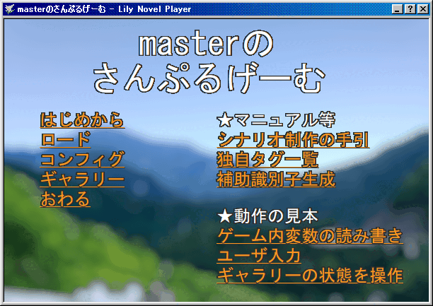

# Lily Novel Player

## 概要
Lily Novel Player(リリー・ノベル・プレイヤー、略して「LNP」)は、ノベルゲームを作れる枠組み的なゴースト＆シェル＆バルーンです。

作者: [ろすえん](https://lnx.flop.jp/) & [おもちよいち](https://sites.google.com/view/omochi-yoichi/)

## 動作環境
[SSP](https://ssp.shillest.net/)(またはSSPと互換性のあるベースウェア)で動作します。

## 使い方
* シェルを切り替えると、ゲームタイトルが切り替わります。

## ダウンロード
[最新のファイルはこちらからDLできます。](https://github.com/lost-nd-xxx/LilyNovelPlayer/releases/latest/download/LilyNovelPlayer.nar)

## 更新履歴
* [大まかな更新履歴](https://github.com/lost-nd-xxx/LilyNovelPlayer/wiki/rough_change_log)
* [詳細な更新履歴](https://github.com/lost-nd-xxx/LilyNovelPlayer/commits/main/)

## web版マニュアル
* [シナリオ制作の手引き](https://lost-nd-xxx.github.io/LilyNovelPlayer/hint.html)
* [独自タグ一覧](https://lost-nd-xxx.github.io/LilyNovelPlayer/tags.html)

## AIの利用について
2026年10月の更新（里々 Unicode 版への対応）から、開発の一部にAI（AnthropicのClaude）を利用しています。
* 利用した範囲：辞書（里々）の修正や不具合の調査、手引き・独自タグ一覧の文章、動作確認用の道具など
* AIによる変更は、すべて作者が内容を確認し、SSPで動作を確かめてから取り込んでいます。

同梱素材のうち、configのサンプルボイスは音声合成ソフト「[VOICEVOX](https://voicevox.hiroshiba.jp/)」で、masterシナリオのBGMは自動作曲サービス「[CREEVO](https://creevo-music.com/)」で作ったものです。詳しくは同梱の readme.txt と、各ツールの公式サイトをご覧ください。

画像と効果音はAIによらない素材です。ただし、`ghost/master/scenarios/master/resources/bg_desktop.png` は、写真を加工する際に、画像編集ソフトのAI機能（背景の自動認識・範囲の選択）を使っています。

